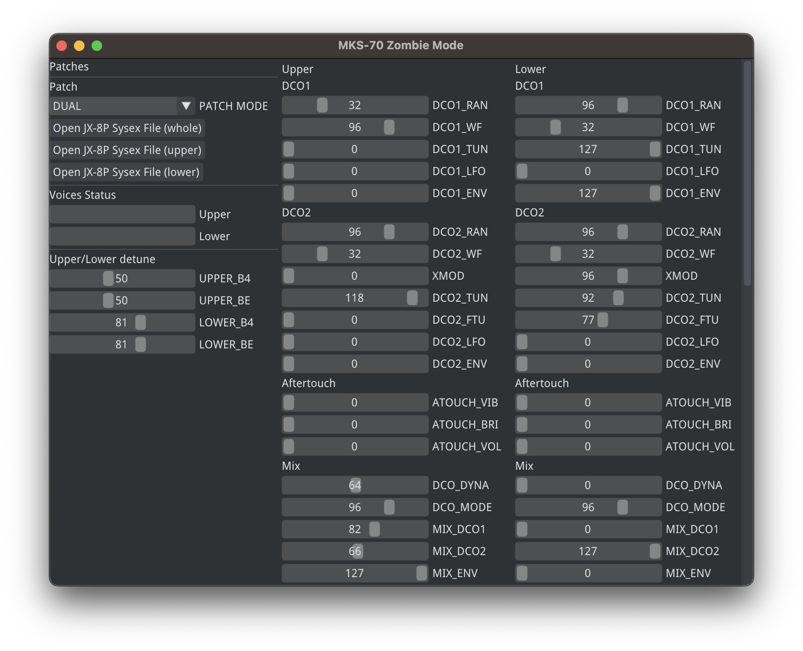

# JX-10/MKS-70/JX-8P Zombie Utility

A software tool to control the voice boards of Roland JX-10/MKS-70/JX-8P with a serial adapter, as described in my YouTube video.



## Building

This project requires a C++ compiler and CMake.

```sh
git clone --recurse-submodules https://github.com/giulioz/mks-zombie.git
cd mks-zombie
mkdir build
cd build
cmake ..
make
./mks-zombie
```
